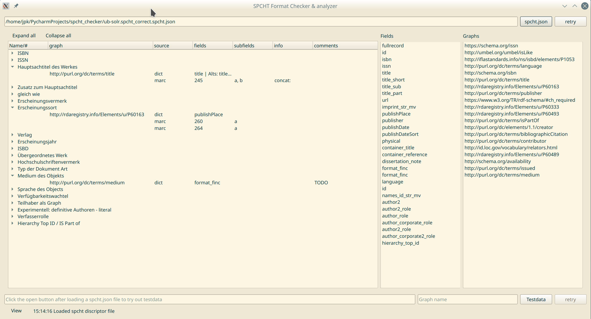

# Graphical User Interface for the SDF

Bla text

## Installation

1. Satisfy all python requirements from *requirements.txt* `python3 -m pip install -r requirements.txt`
2. Copy the newest Version of the Spcht Descriptor Format Class File into the root of this project, it should reside [here](https://github.com/jpkanter/tiny-efre-lod-tools/blob/Imperator/SpchtDescriptorFormat.py)
3. Run main.py `python3 main.py`

## Requirements

* Python >= 3.5 (earlier Versions might work but not tested)

(Spcht Requirements)

* pymarc >= 4.0.0
* rdflib >= 5.0.0

(GUI)

* PySide2 >= 5.12

